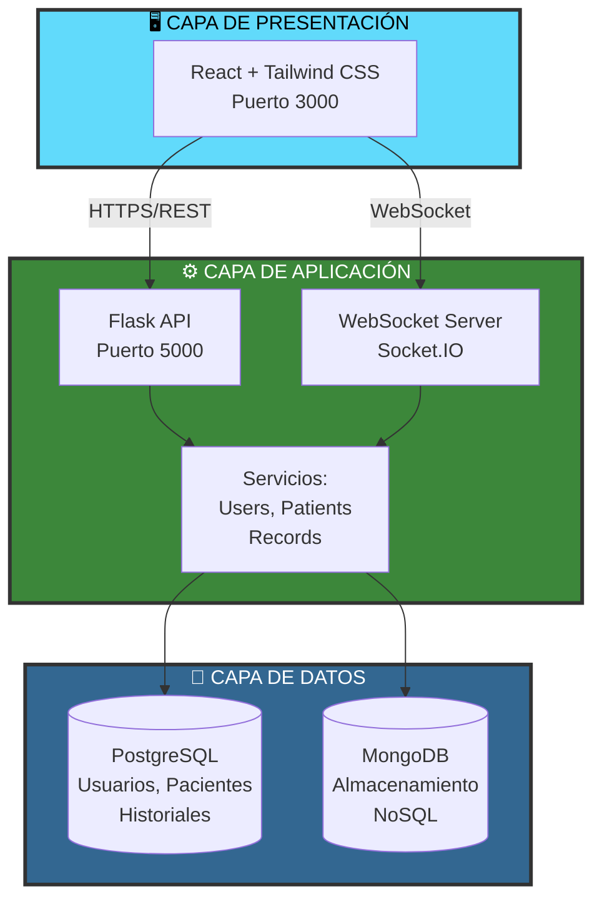

# Synet

### *Sistema de Gestión Hospitalaria*  


---

## 🛠️ Tecnologías utilizadas


---

## ¿Qué es Synet?

Synet es una plataforma concebida para optimizar y actualizar los procesos de gestión hospitalaria. Se trata de una aplicación web que facilita a los profesionales médicos la administración de la información de los casos clínicos, la verificación de los historiales clínicos y su almacenamiento para consultas futuras.

---

## Funciones de Synet

- 🟣 **Gestionar datos de pacientes:** permite consultar la información clínica, actualizar registros y localizar historiales de manera ágil.  
- 🟠 **Acceso seguro:** incorpora autenticación mediante JWT y un sistema de permisos basado en roles.  
- 🟢 **Historial médico:** ofrece un registro integral del paciente, incluyendo información clínica y tratamientos recibidos.  
- 🔵 **Responsive:** garantiza un funcionamiento óptimo en ordenadores, tabletas y dispositivos móviles. 

---

## 🏗️ Arquitectura del Sistema

Synet ha sido desarrollado siguiendo una arquitectura clásica de tres capas, seleccionada por su eficacia y claridad estructural. El sistema incorpora un frontend construido con React, un backend implementado en Spring Boot y un entorno de almacenamiento basado en MongoDB para la gestión de los datos.



---

## ⚙️ Instalación y ejecución

### 1. Clonar el repositorio
```bash

Proyecto-Sirena/
│
├── frontend/        # Código del cliente (HTML, CSS, JS, frameworks)
│   ├── public/
│   ├── src/
│   └── package.json
# EquipoSynet

Repositorio educativo que contiene tres componentes principales: un proyecto Java clásico de pruebas, un microservicio Spring Boot y un frontend estático. Este README ofrece instrucciones claras para ejecutar y contribuir al proyecto, tanto en local como opcionalmente con Docker.


