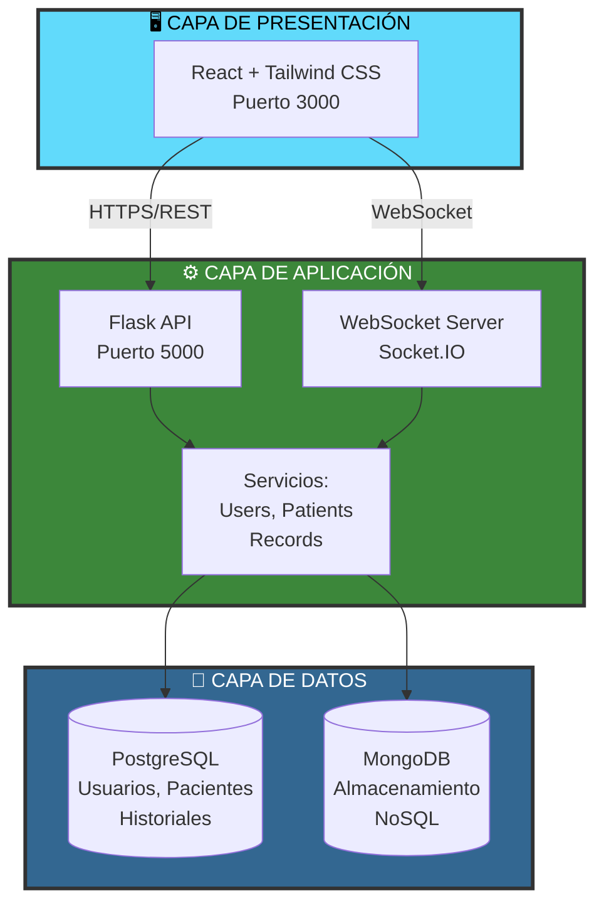

# Synet

### *Sistema de Gestión Hospitalaria*  


---

## 🛠️ Tecnologías utilizadas


---

## ¿Qué es Synet?

Synet es una plataforma concebida para optimizar y actualizar los procesos de gestión hospitalaria. Se trata de una aplicación web que facilita a los profesionales médicos la administración de la información de los casos clínicos, la verificación de los historiales clínicos y su almacenamiento para consultas futuras.

---

## Funciones de Synet

- 🟣 **Gestionar datos de pacientes:** permite consultar la información clínica, actualizar registros y localizar historiales de manera ágil.  
- 🟠 **Acceso seguro:** incorpora autenticación mediante JWT y un sistema de permisos basado en roles.  
- 🟢 **Historial médico:** ofrece un registro integral del paciente, incluyendo información clínica y tratamientos recibidos.  
- 🔵 **Responsive:** garantiza un funcionamiento óptimo en ordenadores, tabletas y dispositivos móviles. 

---

## 🏗️ Arquitectura del Sistema

Synet ha sido desarrollado siguiendo una arquitectura clásica de tres capas, seleccionada por su eficacia y claridad estructural. El sistema incorpora un frontend construido con React, un backend implementado en Spring Boot y un entorno de almacenamiento basado en MongoDB para la gestión de los datos.



---

## ⚙️ Instalación y ejecución

### 1. Clonar el repositorio
```bash

Proyecto-Sirena/
│
├── frontend/        # Código del cliente (HTML, CSS, JS, frameworks)
│   ├── public/
│   ├── src/
│   └── package.json
# EquipoSynet

Repositorio educativo que contiene tres componentes principales: un proyecto Java clásico de pruebas, un microservicio Spring Boot y un frontend estático. Este README ofrece instrucciones claras para ejecutar y contribuir al proyecto, tanto en local como opcionalmente con Docker.

## Tabla de contenidos

1. [Descripción](#descripción)
2. [Arquitectura](#arquitectura)
3. [Requisitos](#requisitos)
4. [Ejecución rápida (local)](#ejecución-rápida-local)
5. [Ejecución con Docker (opcional)](#ejecución-con-docker-opcional)
6. [Estructura del proyecto](#estructura-del-proyecto)
7. [Endpoints expuestos](#endpoints-expuestos)
8. [Comandos útiles](#comandos-útiles)
9. [Solución de problemas](#solución-de-problemas)
10. [Contribuir](#contribuir)
11. [Licencia](#licencia)

## Descripción

EquipoSynet es un repositorio de ejemplo para prácticas educativas que incluye:

- `Backend/`: proyecto Java clásico (clases de ejemplo y CSVs de datos).
- `Backend-springboot/`: servicio Spring Boot que expone endpoints REST y sirve CSVs desde `src/main/resources/data`.
- `frontend/`: frontend estático (HTML/CSS/JS).

El objetivo es proporcionar un entorno sencillo para pruebas, integración y aprendizaje sobre desarrollo full‑stack en Java y frontends estáticos.

## Arquitectura

- Frontend: HTML/CSS/JavaScript. Sugerencia de puerto al servir localmente: `3000`.
- Backend: Spring Boot — expone API REST en `8080` por defecto dentro del JAR.
- Datos: CSVs incluidos en `Backend/` y `Backend-springboot/src/main/resources/data/`.

## Requisitos

- Java 11 o superior
- Git
- PowerShell o terminal equivalente
- Opcional: Docker Desktop si quieres ejecutar mediante contenedores

## Ejecución rápida (local)

Sigue estos pasos para ejecutar el proyecto en tu máquina (sin Docker).

### 1) Clonar el repositorio

```powershell
git clone <URL_DEL_REPOSITORIO>
cd "c:\Users\ivan0\OneDrive\Escritorio\ProyectoIntermodular\EquipoSynet"
```

### 2) Ejecutar backend (Spring Boot)

```powershell
cd Backend-springboot
.\mvnw.cmd spring-boot:run
# Alternativa: empaquetar y ejecutar
.\mvnw.cmd package
java -jar target\*.jar
```

Por defecto, la aplicación escucha en `http://localhost:8080`.

### 3) Servir frontend (estático)

Abrir el archivo `frontend/src/index.html` en el navegador o servirlo con un servidor estático:

```powershell
cd frontend/src
python -m http.server 3000
# o
npx http-server . -p 3000
```

Abrir `http://localhost:3000` en tu navegador.

### 4) Proyecto Java clásico (opcional)

El código de ejemplo se encuentra en `Backend/src/Prueba`. Puedes abrirlo en tu IDE (Eclipse/IntelliJ) o compilar con `javac` respetando `module-info.java`.

## Ejecución con Docker (opcional)

A continuación hay un `docker-compose.yml` de ejemplo que puedes adaptar para orquestar MySQL, Adminer, backend y frontend. Crea `docker-compose.yml` en la raíz si deseas usarlo.

```yaml
version: '3.8'
services:
	mysql:
		image: mysql:8.0
		environment:
			MYSQL_ROOT_PASSWORD: rootpassword
			MYSQL_DATABASE: projectdb
		ports:
			- "3306:3306"
		volumes:
			- db-data:/var/lib/mysql

	adminer:
		image: adminer
		ports:
			- "8080:8080"

	backend:
		build:
			context: ./Backend-springboot
			dockerfile: Dockerfile
		environment:
			SPRING_DATASOURCE_URL: jdbc:mysql://mysql:3306/projectdb
			SPRING_DATASOURCE_USERNAME: root
			SPRING_DATASOURCE_PASSWORD: rootpassword
		ports:
			- "8081:8080"
		depends_on:
			- mysql

	frontend:
		image: node:18-alpine
		working_dir: /app
		volumes:
			- ./frontend:/app
		command: ["npx", "http-server", ".", "-p", "3000"]
		ports:
			- "3000:3000"

volumes:
	db-data:
```

Comandos útiles (PowerShell):

```powershell
# Levantar servicios
docker compose up -d

# Ver logs
docker compose logs -f

# Apagar y eliminar contenedores y volúmenes (cuidado: borra datos)
docker compose down -v
```

Credenciales de ejemplo para MySQL/Adminer (si usas el `docker-compose` anterior):

- Usuario: `root`
- Contraseña: `rootpassword`
- Base de datos: `projectdb`


## Estructura del proyecto

```
EquipoSynet/
 ├─ README.md
 ├─ SoftwareRequirementsSpecification.md
 ├─ Backend/
 │   ├─ pacientes.csv
 │   ├─ sintomas.csv
 │   └─ src/Prueba/* (código Java de ejemplo)
 ├─ Backend-springboot/
 │   ├─ mvnw(.cmd)
 │   ├─ pom.xml
 │   └─ src/main/
 │       ├─ java/com/synet/demoBack/
 │       │   └─ controller/CsvController.java
 │       └─ resources/data/{pacientes.csv,sintomas.csv}
 └─ frontend/
		 └─ src/index.html, js/, style/
```

## Endpoints expuestos (observados)

- `GET /api/csv/hello` — prueba: devuelve texto `Hello World!`.
- `GET /api/csv/pacientes` — devuelve el CSV `pacientes.csv` (respuesta JSON con `filename` y `content`).
- `GET /api/csv/sintomas` — devuelve el CSV `sintomas.csv`.

Ejemplo con `curl`:

```powershell
curl http://localhost:8080/api/csv/pacientes
```

## Comandos útiles

```powershell
# Ejecutar tests del backend (Maven)
cd Backend-springboot
.\mvnw.cmd test

# Ver contenedores Docker
docker compose ps

# Ver puertos ocupados (Windows)
netstat -ano | findstr "3000 8080 8081 3306"
```

## Solución de problemas

- Si Spring Boot no arranca: asegúrate de tener Java instalado y `mvnw.cmd` con permisos de ejecución.
- Si los endpoints no responden: revisa los logs con `.\mvnw.cmd spring-boot:run` o `docker compose logs -f backend`.
- Si MySQL no conecta desde el backend: verifica `SPRING_DATASOURCE_URL` y que el servicio `mysql` esté listo (revisa `docker compose logs mysql`).

## Contribuir

1. Crea un fork
2. Crea una rama para tu feature
3. Haz commits pequeños y claros
4. Abre un Pull Request con descripción y pruebas

